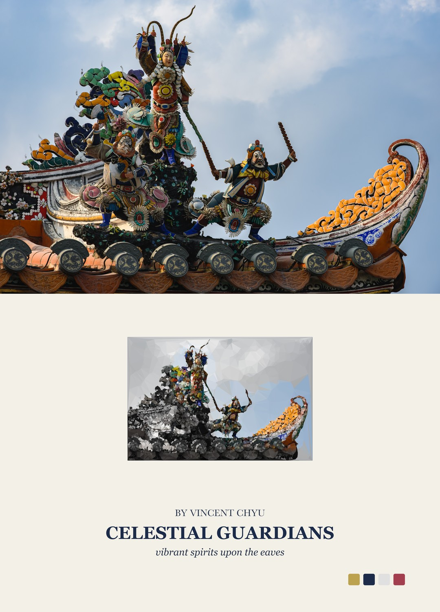
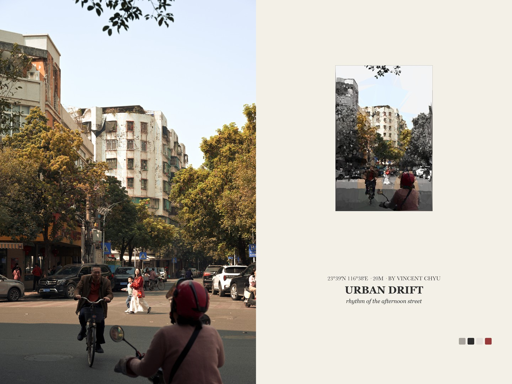
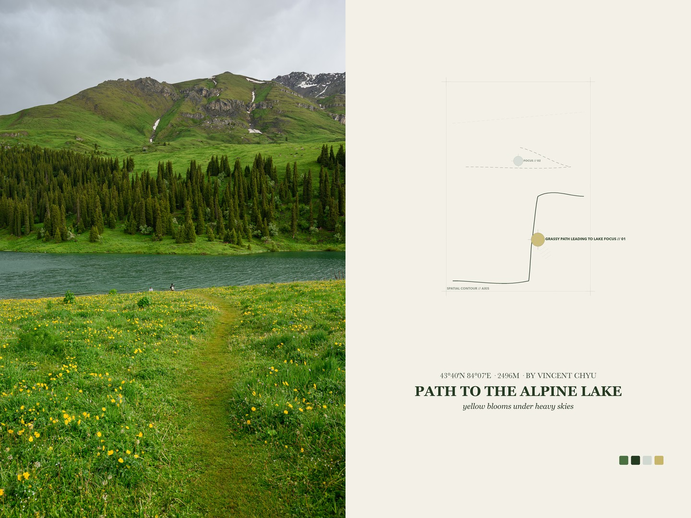

# PicFrame - Photo Info Card & Watermark Frame Generator

Batch generate polished photography info cards and watermark frames for photos in a source folder. The script reads EXIF metadata, matches camera/lens product PNGs, matches brand logos, derives soft background colors from photos, preserves 100% original resolution and aspect ratio, supports lossless uncompressed exports as well as social media (Xiaohongshu, WeChat, etc.) compression policies, and outputs finished cards plus contact sheet previews.

The visual direction comes from a Guizang-style social card workflow and this project's [PROMPT.en.md](PROMPT.en.md), then expands it into a reusable Python utility for photo presentation cards and watermarks.

Chinese version: [README.md](README.md).

## Style Gallery & Scheme Previews

### Scheme 1: Social Camera & Lens Info Cards (`scheme1`)
> Fixed product PNG capsules with exposure telemetry, tailored for Xiaohongshu and social sharing.

<p align="center">
  
  
  
</p>

<p align="center">
  
</p>

---

### Scheme 2: Minimalist Brand Watermark Band (`scheme2`)
> 100% faithful photo aspect ratio and resolution, appending a bottom watermark band with camera brand logo, lens model, and exposure parameters.

<p align="center">
  
</p>

---

### Scheme 3: Hacker Terminal & ASCII Structural Art Diptych (`scheme3`) 🌟
> Computer terminal and ASCII character art matting for geek photographers. Outputs a unified **1:1 square canvas** (original photo as hero, equal-ratio ASCII panel).
> - **`gallery_ascii_terminal`**: Intelligent light/dark adaptive hacker terminal HUD (dark obsidian background + phosphor green matrix for night scenes; light ivory card + dark moss green matrix for day scenes; monospace typography; bottom-anchored telemetry with Auto-Fit anti-overflow).
> - **`gallery_ascii_diptych`**: Dominant photo color background + local chromatic ASCII block matrix diptych with extracted palette swatches.

<p align="center">
  
  
</p>

<p align="center">
  
</p>

---

### Scheme 4: Abstract Editorial Diptych (`scheme4`) 🌟
> Inspired by contemporary art monograph editorial spreads. Seamlessly pairs the faithful photograph with an ivory panel (`#F3F0E8`), extracted 4-color palette, geometric visual memory motifs, and poetic serif title typography.

#### 1. Geometric Texture Diptych (`editorial_diptych`)
> 200-mesh geometric texture with simulated annealing fitting. Automatically applies vertical stacked layout for landscape photos and side-by-side spreads for portrait photos.

<p align="center">
  
  
</p>

#### 2. Architectural Sketch & Saliency Guidance (`editorial_guidance`)
> Architectural fine-line grids with dual-focus crosshair deconstruction, capturing contours, gestures, and spatial perspective.

<p align="center">
  
  
</p>

## Features

- **Four Independent Presentation Schemes**:
  - `scheme1`: Classic social 3:4 portrait / 4:3 landscape cards.
  - `scheme2`: Brand logo watermark band (`watermark_right_logo`).
  - `scheme3`: Hacker terminal & ASCII structural art diptych (`gallery_ascii_terminal`, `gallery_ascii_diptych`, 1:1 square canvas).
  - `scheme4`: Abstract editorial diptych (`editorial_diptych`, `editorial_guidance`, `editorial_asymmetric`, `editorial_minimal`).
- **Mandatory Portrait Left-Right Diptych Constraint**: Portrait photos unconditionally adopt a balanced side-by-side structure across all diptych schemes.
- **1:1 Square Canvas & Hero Photo Balance**: Square canvas generation with the photograph strictly preserved in its native aspect ratio as the primary visual hero.
- **Auto-Fit Typography & Bottom-Anchored Layout**: Dynamic font auto-scaling to prevent overflow in narrow HUD panels, with telemetry data firmly anchored at the bottom.
- **Lossless & Social Compression Policies**: Supports 100% full-resolution lossless exports as well as 1080P/1440P social media compression.
- **Color Profile & ICC Preservation**: Strict preservation of embedded ICC color profiles.
- **Isolated Directory & Manifest Generation**: Structured batch outputs per scheme/layout/format with `contact-sheet.jpg` and `manifest.json`.

## Requirements

- macOS is recommended because the script uses system fonts and ColorSync profiles.
- Python 3
- `exiftool`
- Python packages in `requirements.txt`

Install `exiftool`:

```bash
brew install exiftool
```

Create the virtual environment:

```bash
python3 -m venv .venv
source .venv/bin/activate
python3 -m pip install -r requirements.txt
```

## Folder Structure

Put photos directly in any source folder. The program reads images from that folder and writes results to a `PicFrame/` folder inside it. `20260707/` below is only an example name.

```text
.
├── generate_photo_cards.py              # CLI & TUI entry point
├── core/                                # Core layout engine & shared modules
│   ├── cli.py                           # CLI argument parsing & dispatch
│   ├── tui.py                           # Interactive curses TUI & scheme previews
│   ├── batch.py                         # Batch pipeline orchestration & output handling
│   ├── presentation.py                  # Scheme registry loading & validation
│   ├── renderer.py                      # PresentationRenderer abstract base & dynamic loader
│   ├── context.py                       # Rendering context (RendererContext)
│   ├── output.py                        # Lossless PNG / social JPEG output policies
│   ├── rendering.py                     # Shared Pillow primitives & contact sheet generation
│   ├── drawing.py                       # High-precision anti-aliased drawing & soft shadows
│   ├── metadata.py                      # EXIF / GPS / lens model / clean author parsing
│   ├── fonts.py                         # Cross-platform font discovery & TTC face index
│   ├── config.py                        # Paths, canvas sizes, and constants
│   ├── utils.py                         # Utility helper functions
│   └── renderers/                       # Four independent renderer packages
│       ├── scheme1/                     # Scheme 1: Social camera & lens cards (3:4 / 4:3)
│       │   ├── renderer.py
│       │   ├── cards.py
│       │   └── assets.py
│       ├── scheme2/                     # Scheme 2: Brand watermark band (watermark_right_logo)
│       │   ├── renderer.py
│       │   └── watermark.py
│       ├── scheme3/                     # Scheme 3: Hacker terminal & ASCII art (terminal / diptych)
│       │   ├── renderer.py
│       │   ├── gallery.py
│       │   └── ascii_engine.py
│       └── scheme4/                     # Scheme 4: Abstract editorial diptych (diptych / guidance)
│           ├── renderer.py
│           ├── editorial.py
│           ├── pipeline.py
│           ├── primitive_engine.py
│           ├── svg_rasterizer.py
│           ├── vlm.py
│           ├── prompts/
│           └── generators/
├── config/                              # Scheme declarations & configuration
│   ├── presentation_schemes.json        # Global scheme registry
│   └── schemes/
│       ├── scheme1/
│       │   └── gear_assets.json         # Camera/lens product gear mapping
│       ├── scheme2/
│       │   └── config.yaml              # Watermark band layout, logo & copyright
│       ├── scheme3/
│       │   └── config.yaml              # Terminal HUD, ASCII matrix & color config
│       └── scheme4/
│           └── config.yaml              # Editorial panel, geometric mesh & VLM config
├── assets/                              # Static asset resources
│   ├── scheme1/gear/                    # Scheme 1 camera and lens product PNGs
│   └── scheme2/                         # Scheme 2 fonts and official vector logos
├── docs/                                # Technical specifications & architecture
│   ├── README.md                        # Documentation overview & index
│   ├── scheme1_architecture_and_workflow.md
│   ├── scheme2_architecture_and_workflow.md
│   ├── scheme3_architecture_and_workflow.md
│   └── scheme4_architecture_and_workflow.md
├── img/                                 # README high-res showcase cards
├── requirements.txt                     # Python dependencies
└── 20260707/                            # Example input photo directory
    ├── DSC_0001.jpg
    └── PicFrame/                        # Scheme/layout isolated card output directory
```

Scheme resources are isolated by scheme. Scheme 1 product PNGs live in `assets/scheme1/gear/`; Scheme 2 fonts and logos live in `assets/scheme2/`; all schemes maintain isolated configs under `config/schemes/<scheme>/`.

Presentation schemes are registered in `config/presentation_schemes.json`. The configuration contains the scheme ID, display name, supported layouts, default layout, and renderer ID; coordinates, typography, and drawing behavior remain in Python.

## Usage

Activate the environment:

```bash
source .venv/bin/activate
```

### 1. Interactive TUI Mode (Recommended)
Launch the interactive visual terminal interface to choose source photo directory, presentation scheme, layout, and output format:

```bash
python3 generate_photo_cards.py
```

### 2. Command Line Batch Mode (CLI)

Run directly on a source directory with default scheme (`scheme1`):

```bash
python3 generate_photo_cards.py --source 20260707
```

Explicitly select presentation schemes and sub-layouts:

```bash
# Scheme 1: Social Camera & Lens Info Cards (portrait 3:4 / landscape 4:3)
python3 generate_photo_cards.py --source 20260707 --scheme scheme1 --layout portrait
python3 generate_photo_cards.py --source 20260707 --scheme scheme1 --layout landscape

# Scheme 2: Minimalist Brand Watermark Band
python3 generate_photo_cards.py --source 20260707 --scheme scheme2

# Scheme 3: Hacker Terminal & ASCII Deconstruction (default gallery_ascii_terminal)
python3 generate_photo_cards.py --source 20260707 --scheme scheme3 --layout gallery_ascii_terminal
python3 generate_photo_cards.py --source 20260707 --scheme scheme3 --layout gallery_ascii_diptych

# Scheme 4: Abstract Editorial Diptych (default editorial_diptych)
python3 generate_photo_cards.py --source 20260707 --scheme scheme4 --layout editorial_diptych
python3 generate_photo_cards.py --source 20260707 --scheme scheme4 --layout editorial_guidance
python3 generate_photo_cards.py --source 20260707 --scheme scheme4 --layout editorial_asymmetric
python3 generate_photo_cards.py --source 20260707 --scheme scheme4 --layout editorial_minimal
```

### 3. Compression & Output Quality

```bash
# Lossless uncompressed mode (default): 100% full-resolution lossless PNG
python3 generate_photo_cards.py --source 20260707 --compression none

# Social media compression mode: 1080P/1440P high-quality JPEG
python3 generate_photo_cards.py --source 20260707 --compression jpeg
```

### 4. Output Folder Structure

New-mode outputs are isolated by scheme, layout, and compression format:

```text
<source_dir>/PicFrame/<scheme>/<layout>/<compression>/
├── <photo_stem>_card.png / <photo_stem>_card.jpg
├── contact-sheet.jpg                   # Batch contact sheet preview
└── manifest.json                       # Execution metadata and file list
```

## Assets

`config/schemes/scheme1/gear_assets.json` is scheme1's config file for default camera/lens PNGs and camera/lens model mappings. Current default config:

```json
{
  "defaults": {
    "camera": "../../../assets/scheme1/gear/default-camera.png",
    "lens": "../../../assets/scheme1/gear/default-lens.png"
  },
  "cameras": {
    "NIKON Z6_3": "../../../assets/scheme1/gear/Z6III.png",
    "Nikon Z6III": "../../../assets/scheme1/gear/Z6III.png"
  },
  "lenses": {
    "NIKKOR Z 24-120mm f/4 S": "../../../assets/scheme1/gear/NIKKOR Z 24-120mm f4 S.png",
    "NIKKOR Z 35mm f/1.8 S": "../../../assets/scheme1/gear/NIKKOR Z 35mm f1.8 S.png"
  }
}
```

If no camera or lens match is found, the script prints a warning and uses `default-camera.png` or `default-lens.png` without stopping the batch.

## Lens Text Parsing

Lens display text is no longer hard-coded to `Nikon`, and `NIKKOR Z` is not stripped away. The script finds the focal-length number before `mm`; everything before that number becomes the lens family, while the focal length and aperture stay in the parameter line.

Examples:

```text
NIKKOR Z 24-120mm f/4 S
Family: NIKKOR Z
Parameters: 24-120mm f/4 S

iPhone 13 Pro back triple camera 9mm f/2.8
Family: iPhone 13 Pro back triple camera
Parameters: 9mm f/2.8
```

## Output Notes

- The main photo is contain-fit, not cropped or stretched.
- The card background is generated per photo, then softened for UI readability.
- Camera and lens areas are fixed; text in one area should not drift into the other.
- The GPS capsule is shown only when EXIF GPS data exists. If altitude exists, it uses a format like `43°48'N 87°34'E · 1018m`.
- ICC profile handling keeps source color behavior predictable for Preview/Finder and publishing workflows.

## Architecture & Development Notes

PicFrame adopts a modular micro-kernel architecture with cleanly decoupled modules:

- `core/cli.py`: Command-line parsing, default dispatch, and help system.
- `core/tui.py`: Interactive curses terminal, realtime ASCII previews, and workflow guidance.
- `core/presentation.py`: Presentation scheme registry, dependency validation, and loader.
- `core/renderer.py`: `PresentationRenderer` abstract base class and dynamic loader.
- `core/context.py`: Standardized `RendererContext` (shared EXIF, palette, effective layout).
- `core/renderers/scheme1/`: Scheme 1 package for 3:4 and 4:3 social camera info cards.
- `core/renderers/scheme2/`: Scheme 2 package for native aspect ratio watermark bands.
- `core/renderers/scheme3/`: Scheme 3 package for hacker terminal HUDs and ASCII character matrices.
- `core/renderers/scheme4/`: Scheme 4 package for 4-stage VLM vision pipeline, 200-mesh annealing, and architectural sketch guidance.
- `core/drawing.py`: High-precision geometric primitive drawing and soft shadow rendering.
- `core/rendering.py`: Cross-scheme shared Pillow primitives, compression policies, and contact sheets.
- `core/metadata.py`: EXIF parsing, GPS/altitude formatting, lens parsing, and clean author sanitization.
- `core/fonts.py`: Cross-platform font discovery and TTC font family indexing.
- `core/output.py`: Lossless PNG and high-quality JPEG encoding policies.
- `core/batch.py`: Batch orchestration, concurrent execution, and directory archiving.

For technical specifications and design rationale, refer to the `docs/` directory:
- 📘 [Scheme 1 Specification](docs/scheme1_architecture_and_workflow.md)
- 📘 [Scheme 2 Specification](docs/scheme2_architecture_and_workflow.md)
- 📘 [Scheme 3 Specification](docs/scheme3_architecture_and_workflow.md)
- 📘 [Scheme 4 Specification](docs/scheme4_architecture_and_workflow.md)
- 🧠 [AI Development Conventions & Architecture Memory](PROMPT.en.md)
