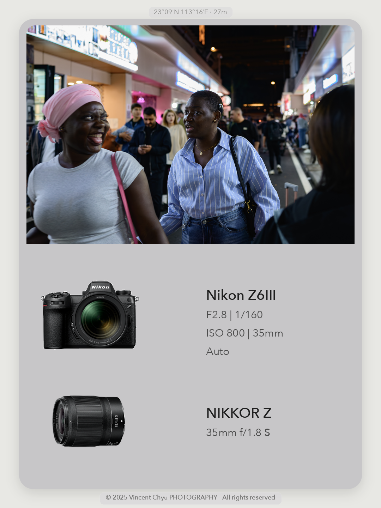
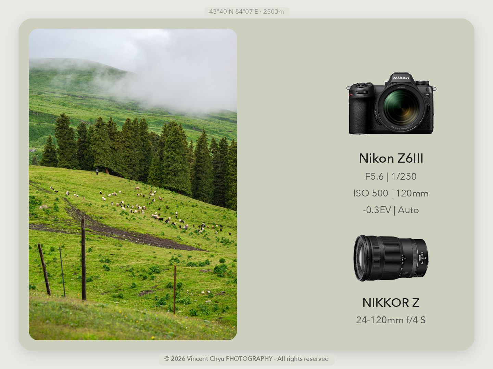

# 小红书摄影信息卡生成器

把一个文件夹里的照片批量生成小红书摄影信息卡。脚本会读取 EXIF，匹配相机和镜头产品 PNG，从照片中提取柔和背景色，保留主图比例，并输出单张成品图和汇总预览图。

这个项目的设计原则来源于 Guizang social card workflow 和本项目的 [PROMPT.md](/Users/vincent/Developer/code/python_code/PicFrame34/PROMPT.md)，但最终形态是一个独立、可复用的摄影信息卡 Python 工具。

英文版见 [README.en.md](/Users/vincent/Developer/code/python_code/PicFrame34/README.en.md)。

## 项目预览

<p align="center">
  
  
  
</p>

<p align="center">
  
</p>

## 功能

- 竖图源文件可选择 `portrait` 3:4 展示或 `landscape` 4:3 横版展示。
- 使用 `exiftool` 读取照片 EXIF。
- 主图保持原始比例，不拉伸、不强行裁切填满。
- 支持横图和竖图，使用 contain-fit 展示。
- 根据照片自动生成柔和背景色。
- 相机区域和镜头区域固定，曝光参数不会把镜头信息挤下去。
- 曝光参数过多时会用 ` | ` 合并行。
- 镜头信息会从 `LensModel` / `LensID` / `Lens` 中解析型号和参数。
- 长镜头名称会自动换行或截断。
- 有 GPS 时，在顶部显示浅胶囊坐标；有海拔时追加海拔。
- 底部显示版权胶囊：`© <year> Vincent Chyu PHOTOGRAPHY - All rights reserved`。
- 年份优先从 EXIF 拍摄时间读取。
- 保留原图 ICC；sRGB 输入会写入 `sRGB IEC61966-2.1`。
- 自动生成 `PicFrame34/contact-sheet.jpg` 方便快速检查。

## 环境要求

- 推荐 macOS，因为脚本使用系统字体和 ColorSync profile。
- Python 3
- `exiftool`
- `requirements.txt` 中的 Python 包。

安装 `exiftool`：

```bash
brew install exiftool
```

创建虚拟环境：

```bash
python3 -m venv .venv
source .venv/bin/activate
python3 -m pip install -r requirements.txt
```

## 目录结构

把照片放进任意源目录中，程序会直接读取该目录下的图片，并把结果写入同目录的 `PicFrame34/`。下面的 `20260707/` 只是示例名称。

```text
.
├── generate_xhs_photo_cards.py
├── core/
│   ├── cli.py
│   ├── tui.py
│   ├── batch.py
│   ├── rendering.py
│   ├── metadata.py
│   ├── assets.py
│   ├── fonts.py
│   ├── config.py
│   └── utils.py
├── requirements.txt
├── config/
│   └── gear_assets.json
├── assets/
│   └── gear/
│       ├── default-camera.png
│       ├── default-lens.png
│       ├── Z6III.png
│       ├── NIKKOR Z 24-120mm f4 S.png
│       └── NIKKOR Z 35mm f1.8 S.png
└── 20260707/
    ├── DSC_0001.jpg
    ├── DSC_0002.png
    └── PicFrame34/
```

内置相机和镜头产品 PNG 放在 `assets/gear/`。任务专属素材可以放在任务文件夹的 `assets/gear/` 或任务文件夹根目录，优先级高于内置素材。型号到素材的映射统一维护在 `config/gear_assets.json`。

## 使用方法

激活环境：

```bash
source .venv/bin/activate
```

打开 TUI 选择照片源目录：

```bash
python3 generate_xhs_photo_cards.py
```

脚本本身也可以作为可执行文件运行：

```bash
./generate_xhs_photo_cards.py
```

也可以直接指定源目录，适合批处理：

```bash
python3 generate_xhs_photo_cards.py --source 20260707
```

只有当原图是竖图，也就是宽度小于高度时，`--layout` 才会改变输出版式。竖图想使用横版信息卡时：

```bash
python3 generate_xhs_photo_cards.py --source 20260707 --layout landscape
```

这种竖图横版输出为 `1440 x 1080`，主图在左侧，信息栏在右侧，主图展示图四个角保留圆角。横图源文件不受这个选项影响，继续使用默认卡片布局。

不激活环境也可以直接运行：

```bash
.venv/bin/python3 generate_xhs_photo_cards.py --source 20260707
```

兼容旧任务结构时可以显式使用：

```bash
python3 generate_xhs_photo_cards.py --legacy-task 20260707
```

旧模式会读取 `20260707/src/`，并写入 `20260707/result/`。

如果需要把新模式输出到自定义目录：

```bash
python3 generate_xhs_photo_cards.py --source 20260707 --output 20260707-cards
```

输出位置：

```text
20260707/PicFrame34/
```

每张源照片会生成：

```text
<photo_stem>_card.png
```

脚本还会生成汇总图：

```text
20260707/PicFrame34/contact-sheet.jpg
```

## 素材匹配

`config/gear_assets.json` 是全局配置文件，包含默认相机/镜头图，以及相机型号、镜头 ID 到 PNG 文件的映射。当前默认配置：

```json
{
  "defaults": {
    "camera": "../assets/gear/default-camera.png",
    "lens": "../assets/gear/default-lens.png"
  },
  "cameras": {
    "NIKON Z6_3": "../assets/gear/Z6III.png",
    "Nikon Z6III": "../assets/gear/Z6III.png"
  },
  "lenses": {
    "NIKKOR Z 24-120mm f/4 S": "../assets/gear/NIKKOR Z 24-120mm f4 S.png",
    "NIKKOR Z 35mm f/1.8 S": "../assets/gear/NIKKOR Z 35mm f1.8 S.png"
  }
}
```

如果相机或镜头无法匹配，脚本会打印 warning，并使用 `default-camera.png` 或 `default-lens.png`，不会中断整个批处理。后续要支持更多机型，只需要把 EXIF 中的 `Model` / `CameraModelName` 或 `LensModel` / `LensID` / `Lens` 字符串加入 `config/gear_assets.json`，并把对应 PNG 放进 `assets/gear/`。

iPhone 的 `LensModel` / `LensID` 会包含当前焦段和光圈，例如 `iPhone 14 Pro back triple camera 6.86mm f/1.78`。素材匹配时会额外尝试模组级 key `iPhone 14 Pro back triple camera`，因为 iPhone 不可换镜头，PNG 应代表整组摄像头模组；卡片上的镜头文字仍保留完整焦段和光圈。

## 镜头文字解析

镜头显示不再硬编码为 `Nikon`，也不会粗暴删除 `NIKKOR Z`。脚本会在完整镜头字符串中找到 `mm` 之前的焦段数字，把数字之前的内容作为镜头型号，把焦段和光圈继续放在参数位置。

示例：

```text
NIKKOR Z 24-120mm f/4 S
型号：NIKKOR Z
参数：24-120mm f/4 S

iPhone 13 Pro back triple camera 9mm f/2.8
型号：iPhone 13 Pro back triple camera
参数：9mm f/2.8
```

参数中的独立 `S` 会用更重的字重显示，因为它代表 Nikon S-Line 高质量镜头。

## 输出说明

- 主图使用 contain-fit，不裁切、不拉伸。
- 背景色每张照片单独生成，并柔化到适合 UI 阅读的范围。
- 相机和镜头区域固定，文字不会互相侵入。
- 顶部 GPS 胶囊只在照片有 EXIF GPS 时显示；如果有海拔，格式类似 `43°48'N 87°34'E · 1018m`。
- ICC profile 会尽量继承，方便 Preview/Finder 和发布流程保持颜色一致。

## 开发说明

`generate_xhs_photo_cards.py` 现在只是可执行入口，核心实现拆在 `core/` 包中：

- `core/cli.py`：命令行参数和默认 TUI 入口。
- `core/tui.py`：`curses` 目录选择、布局选择和进度显示。
- `core/batch.py`：源目录扫描、输出目录、批处理和兼容旧任务结构。
- `core/rendering.py`：Pillow/numpy 制图核心、布局、圆角、文字和 contact sheet。
- `core/metadata.py`：EXIF、GPS、海拔、镜头名、ICC profile 处理。
- `core/assets.py`：`config/gear_assets.json` 和相机/镜头 PNG 查找。
- `core/fonts.py`：macOS 字体查找和 `.ttc` face index。
- `core/config.py`：路径、画布尺寸、扩展名、布局常量。

布局是确定性的，不会因为文字长短改变整体结构：

- 默认画布：`1080 x 1440`
- 竖图源文件选择 `landscape` 时画布：`1440 x 1080`
- 默认主图区域：固定顶部区域
- 竖图源文件横版布局：主图在左侧，信息栏在右侧
- 信息区：固定相机区域和固定镜头区域
- 字体：显式 `.ttc` face index，避免误加载粗体
- 汇总图：生成卡片后自动创建

未来修改请先阅读 [PROMPT.md](/Users/vincent/Developer/code/python_code/PicFrame34/PROMPT.md)，里面记录了设计和实现约束。
