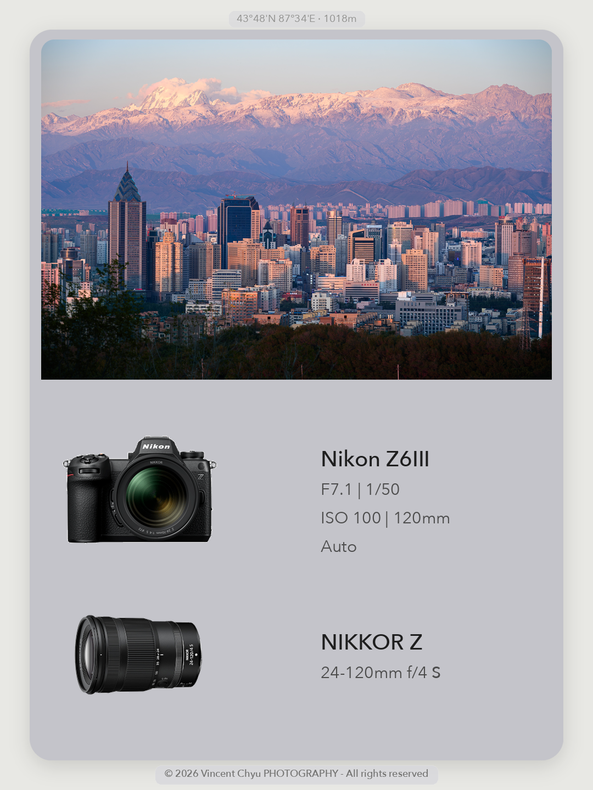
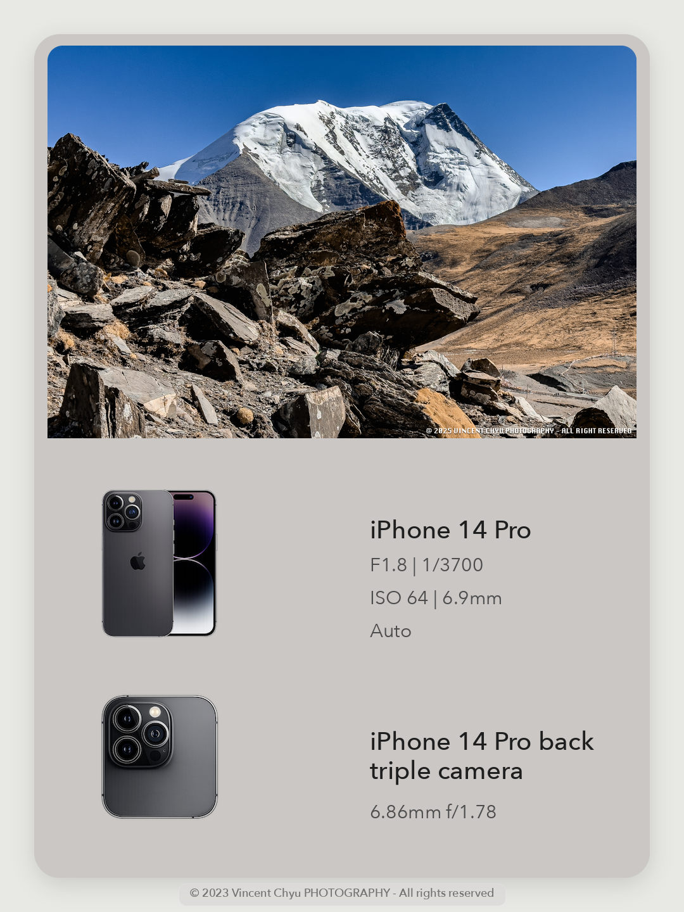
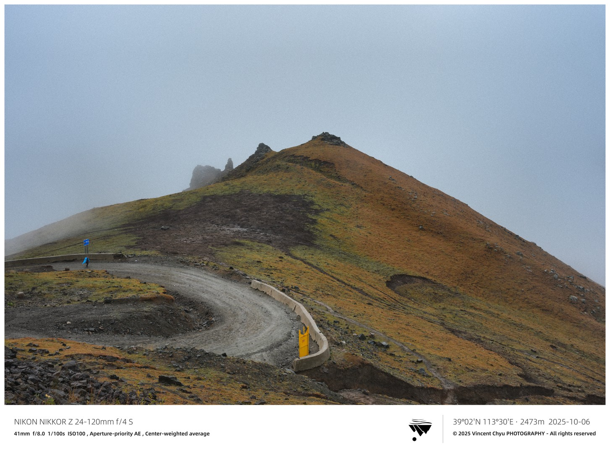
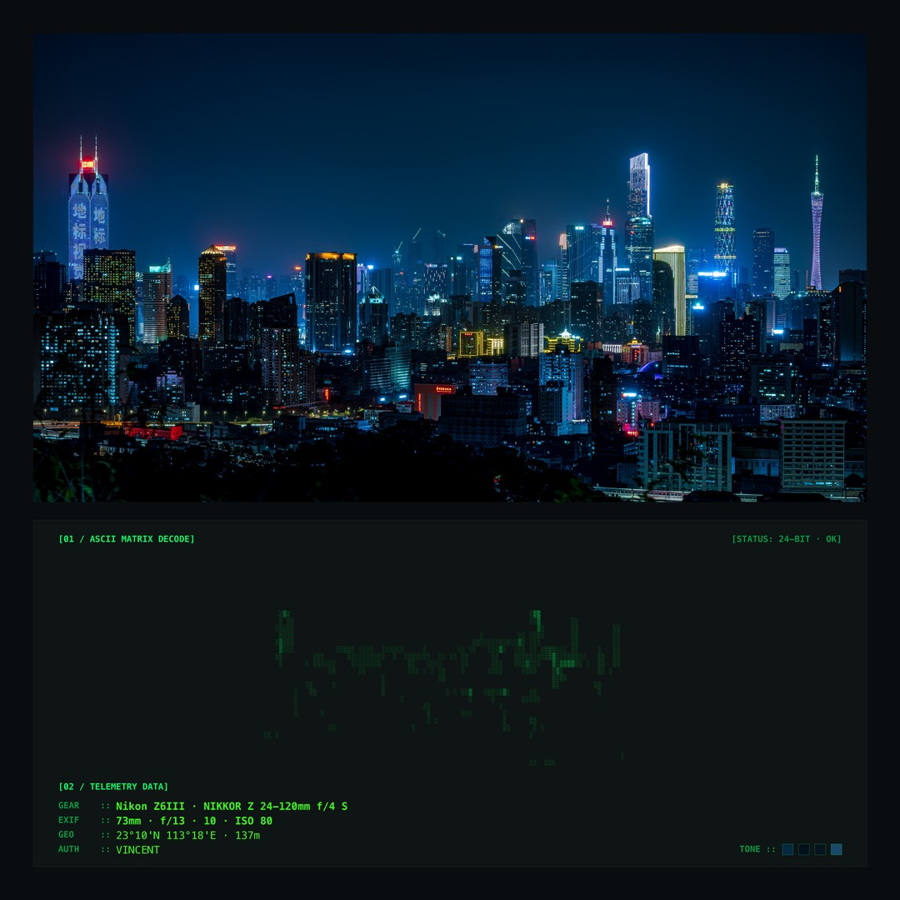
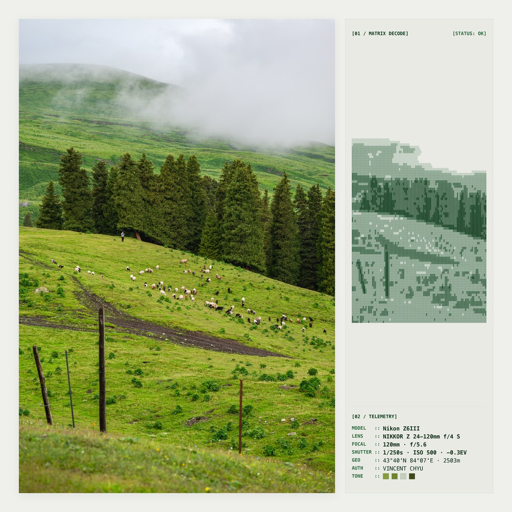
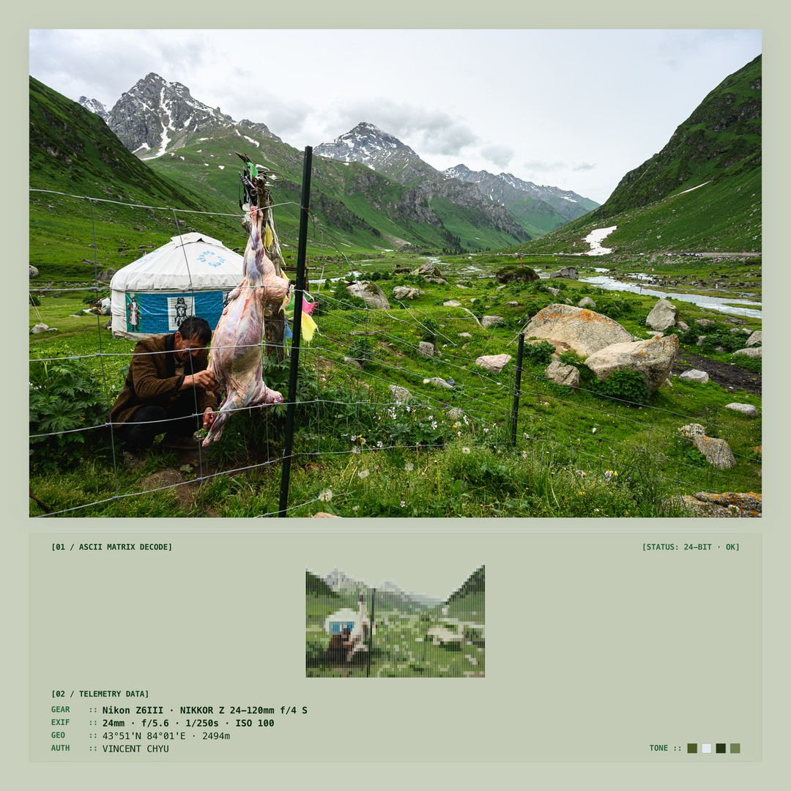
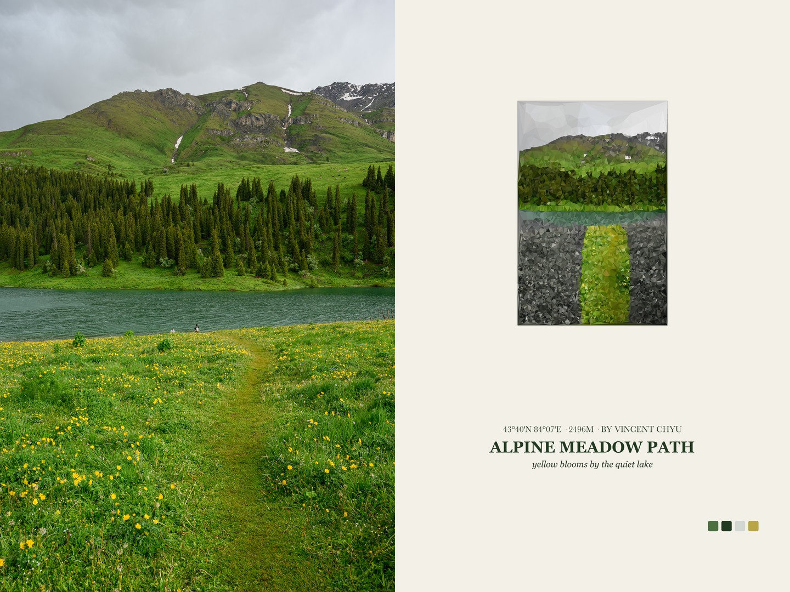
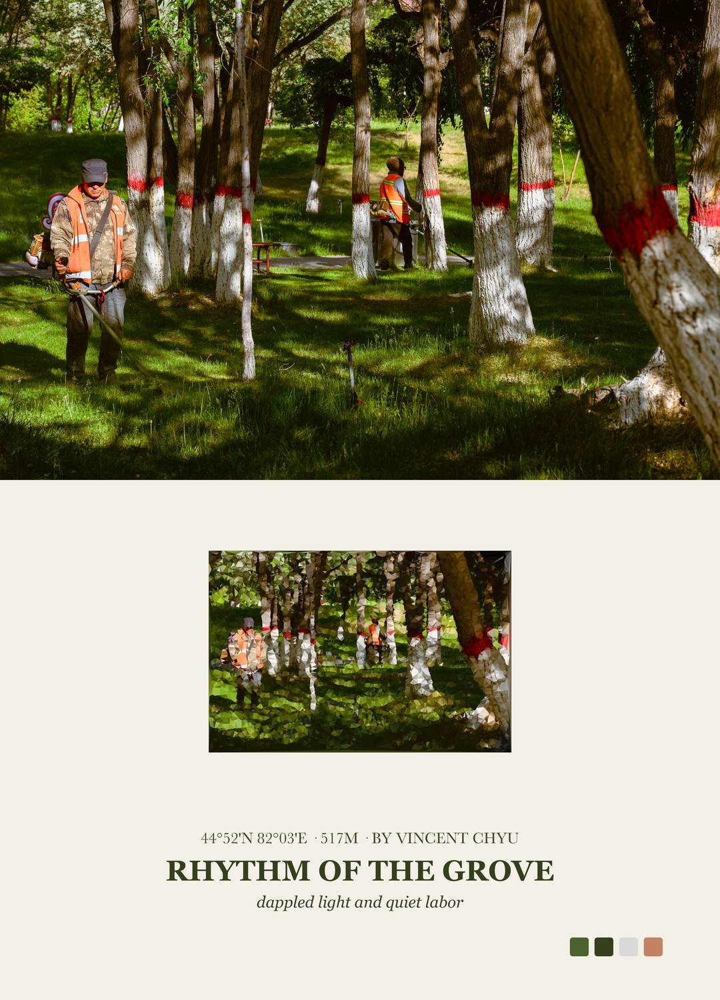
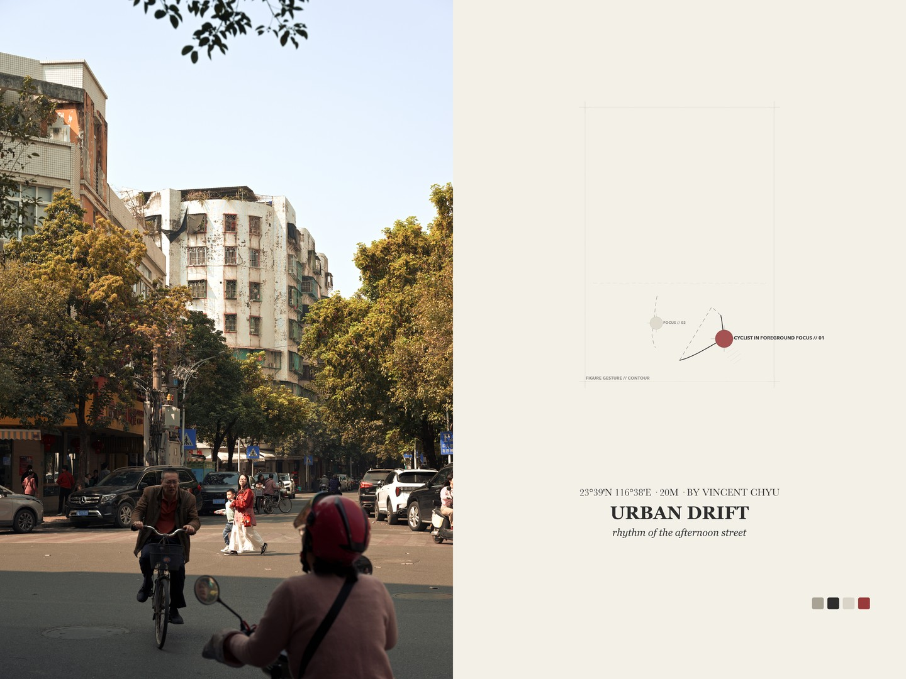
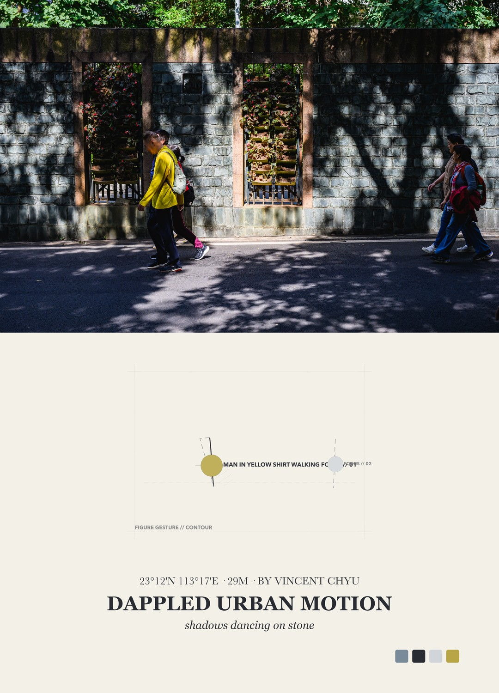

# PicFrame - 摄影信息卡与水印框架生成器

把一个文件夹里的照片批量生成精致的摄影信息卡与水印框架。脚本会读取 EXIF 数据，匹配相机和镜头产品 PNG，提取品牌 Logo，从照片中衍生柔和背景色，保留主图原始比例与无损像素细节，支持原始分辨率无损导出与社交平台（如小红书、朋友圈）输出压缩，并自动生成单张成品卡片和汇总预览图。

这个项目的设计原则来源于 Guizang social card workflow 和本项目的 [PROMPT.md](/Users/vincent/Developer/code/python_code/PicFrame/PROMPT.md)，但最终形态是一个独立、可复用的摄影信息卡与水印渲染 Python 工具。

英文版见 [README.en.md](/Users/vincent/Developer/code/python_code/PicFrame/README.en.md)。

## 样式展览与方案预览

### 方案 1：小红书相机镜头信息卡 (`scheme1`)
> 固定相机、镜头产品 PNG 与曝光参数胶囊，专为小红书与移动端社交分享设计。

<p align="center">
  
  
  
</p>

<p align="center">
  
</p>

---

### 方案 2：品牌极简水印带 (`scheme2`)
> 100% 忠实保留照片原始长宽比与无损画质，在底部自然拼接相机品牌 Logo、镜头型号与曝光参数水印栏。

<p align="center">
  
</p>

---

### 方案 3：黑客终端与 ASCII 结构解构 (`scheme3`) 🌟
> 专为极客摄影师打造的计算机终端艺术装裱。统一输出 **1:1 正方形标准画幅**（原图绝对主导，抽象卡等比一致）。
> - **`gallery_ascii_terminal`**：智能明暗自适应黑客终端 HUD 仪表舱（暗色照片配暗黑底板+黑客荧光绿矩阵，亮色照片配亮卡纸+深墨绿矩阵，等宽机械字体，竖图参数严格沉底且 Auto-Fit 防溢出）。
> - **`gallery_ascii_diptych`**：原片主色提取底板 + 真实色彩（`local_chromatic`）ASCII 结构画双联与调色板色卡。

<p align="center">
  
  
</p>

<p align="center">
  
</p>

---

### 方案 4：抽象艺术编辑双联 (`scheme4`) 🌟
> 灵感源自现代艺术画册，完全跳出传统参数相框。原片无缝衔接象牙色面板（`#F3F0E8`），自动提炼画面 4 色调色板与空间几何记忆母题，排版信达雅的诗意英文衬线标题。

#### 1. 经典几何肌理双联 (`editorial_diptych`)
> 200 晶格几何肌理退火拟合，横图自动采用优雅上下双联，竖图采用左图右画册并排。

<p align="center">
  
  
</p>

#### 2. 精工手稿与空间焦点引导 (`editorial_guidance`)
> 建筑手稿细线网格与多焦点彩色准星解构，完美呈现主体轮廓与空间透视关系。

<p align="center">
  
  
</p>

## 功能特性

- **四大独立展示方案体系**：
  - `scheme1`：小红书经典 3:4 竖版 / 4:3 横版信息卡；
  - `scheme2`：品牌 Logo 极简水印带（`watermark_right_logo`）；
  - `scheme3`：黑客终端与 ASCII 结构解构方案（`gallery_ascii_terminal`、`gallery_ascii_diptych`，1:1 正方形自适应）；
  - `scheme4`：抽象艺术编辑双联方案（`editorial_diptych`、`editorial_guidance`、`editorial_asymmetric`、`editorial_minimal`）。
- **竖图左右双联硬性约束**：对于所有双联与装裱方案（Scheme 3、Scheme 4 等），竖画幅照片一律自动采用左图右文并排结构，消除细长失衡感。
- **1:1 正方形自适应与原图主导原则**：在极客 HUD 终端与双联模式中，统一输出 1:1 正方形画幅，原图 100% 原始比例占据绝对视觉中心。
- **Auto-Fit 动态字阶与沉底排版**：HUD 终端模式下长参数自动结构化拆行，动态自适应缩字防溢出，元数据严格沉底。
- **无损与社交压缩双策略**：支持 100% 原始高精无损导出与社交平台（1080P/1440P）优化压缩。
- **智能色彩衍生**：根据照片像素自动提取柔和背景色、主色调及 4 色调色板。
- **完整 EXIF/GPS 提取与作者清洗**：智能识别相机、镜头、曝光组合、GPS 坐标与海拔，自动清洗规范化摄影作者姓名。
- **色彩管理**：严格保留原图 ICC 配置文件，保证色彩精准还原。
- **隔离输出与清单机制**：自动生成按方案、布局、格式隔离的输出目录，附带 `contact-sheet.jpg` 预览联系表与 `manifest.json`。

## 环境要求

- 推荐 macOS，因为脚本使用系统字体和 ColorSync profile。
- Python 3
- `exiftool`
- `requirements.txt` 中的 Python 包。

安装 `exiftool`：

```bash
brew install exiftool
```

创建虚拟环境：

```bash
python3 -m venv .venv
source .venv/bin/activate
python3 -m pip install -r requirements.txt
```

## 目录结构

把照片放进任意源目录中，程序会直接读取该目录下的图片，并把结果写入同目录的 `PicFrame/`。下面的 `20260707/` 只是示例名称。

```text
.
├── generate_photo_cards.py              # 主程序命令行与 TUI 入口
├── core/                                # 核心排版引擎与公共模块
│   ├── cli.py                           # 命令行参数解析与分发
│   ├── tui.py                           # 交互式终端 curses 菜单与方案预览
│   ├── batch.py                         # 批处理流水线编排与产物归档
│   ├── presentation.py                  # 方案注册表加载与校验
│   ├── renderer.py                      # 渲染器抽象基类与动态加载
│   ├── context.py                       # 照片渲染上下文 (RendererContext)
│   ├── output.py                        # 无损 PNG / 社交压缩 JPEG 输出策略
│   ├── rendering.py                     # 跨方案共享图像原语与联系表生成
│   ├── drawing.py                       # 几何形状绘制与阴影渲染原语
│   ├── metadata.py                      # EXIF / GPS / 镜头型号 / 作者清洗
│   ├── fonts.py                         # 跨平台字体匹配与 TTC 字阶管理
│   ├── config.py                        # 路径、画幅与常量配置
│   ├── utils.py                         # 通用工具函数
│   └── renderers/                       # 四大独立方案渲染器包
│       ├── scheme1/                     # 方案1：小红书相机镜头卡片 (3:4 / 4:3)
│       │   ├── renderer.py
│       │   ├── cards.py
│       │   └── assets.py
│       ├── scheme2/                     # 方案2：品牌极简水印带 (watermark_right_logo)
│       │   ├── renderer.py
│       │   └── watermark.py
│       ├── scheme3/                     # 方案3：黑客终端与 ASCII 解构 (terminal / diptych)
│       │   ├── renderer.py
│       │   ├── gallery.py
│       │   └── ascii_engine.py
│       └── scheme4/                     # 方案4：抽象艺术编辑双联 (diptych / guidance)
│           ├── renderer.py
│           ├── editorial.py
│           ├── pipeline.py
│           ├── primitive_engine.py
│           ├── svg_rasterizer.py
│           ├── vlm.py
│           ├── prompts/
│           └── generators/
├── config/                              # 方案声明与配置文件
│   ├── presentation_schemes.json        # 全局方案注册清单
│   └── schemes/
│       ├── scheme1/
│       │   └── gear_assets.json         # 相机/镜头产品图映射
│       ├── scheme2/
│       │   └── config.yaml              # 水印栏布局、Logo 与版权配置
│       ├── scheme3/
│       │   └── config.yaml              # 终端 HUD、ASCII 解构与色彩配置
│       └── scheme4/
│           └── config.yaml              # 编辑面板、几何晶格与 VLM 参数配置
├── assets/                              # 静态素材资源
│   ├── scheme1/gear/                    # 方案1相机与镜头产品 PNG
│   └── scheme2/                         # 方案2字体与品牌官方矢量 Logo
├── docs/                                # 架构设计与技术规范文档
│   ├── README.md                        # 文档总索引导航
│   ├── scheme1_architecture_and_workflow.md
│   ├── scheme2_architecture_and_workflow.md
│   ├── scheme3_architecture_and_workflow.md
│   └── scheme4_architecture_and_workflow.md
├── img/                                 # README 样式展览高清示例图
├── requirements.txt                     # Python 依赖清单
└── 20260707/                            # 示例源照片输入目录
    ├── DSC_0001.jpg
    └── PicFrame/                        # 方案/布局隔离的卡片输出目录
```

方案资源完全按方案隔离：`scheme1` 的产品 PNG 放在 `assets/scheme1/gear/`；`scheme2` 的字体和 Logo 放在 `assets/scheme2/`；所有方案各自拥有独立的 `config/schemes/<scheme>/` 配置。

展示方案注册在 `config/presentation_schemes.json`。每个方案声明方案 ID、支持的 layout、输出目录、renderer import path、专属 config、resources 和 dependencies。批处理只依赖 `PresentationRenderer` 抽象基类动态加载，新增方案无需修改核心批处理引擎。

## 使用方法

激活虚拟环境：

```bash
source .venv/bin/activate
```

### 1. 交互式终端 TUI 模式 (推荐)
直接运行脚本，通过交互式可视化终端选择源照片目录、展示方案、版式布局与输出格式：

```bash
python3 generate_photo_cards.py
```

### 2. 命令行批处理模式 (CLI)

直接指定源目录并使用默认方案 (`scheme1`)：

```bash
python3 generate_photo_cards.py --source 20260707
```

显式选择四大展示方案与子布局：

```bash
# 方案 1：小红书经典相机镜头卡片 (支持 portrait 竖版 / landscape 横版)
python3 generate_photo_cards.py --source 20260707 --scheme scheme1 --layout portrait
python3 generate_photo_cards.py --source 20260707 --scheme scheme1 --layout landscape

# 方案 2：品牌极简水印带
python3 generate_photo_cards.py --source 20260707 --scheme scheme2

# 方案 3：黑客终端与 ASCII 结构解构 (默认 gallery_ascii_terminal)
python3 generate_photo_cards.py --source 20260707 --scheme scheme3 --layout gallery_ascii_terminal
python3 generate_photo_cards.py --source 20260707 --scheme scheme3 --layout gallery_ascii_diptych

# 方案 4：抽象艺术编辑双联 (默认 editorial_diptych)
python3 generate_photo_cards.py --source 20260707 --scheme scheme4 --layout editorial_diptych
python3 generate_photo_cards.py --source 20260707 --scheme scheme4 --layout editorial_guidance
python3 generate_photo_cards.py --source 20260707 --scheme scheme4 --layout editorial_asymmetric
python3 generate_photo_cards.py --source 20260707 --scheme scheme4 --layout editorial_minimal
```

### 3. 输出质量与压缩策略

```bash
# 无损模式 (默认)：输出 100% 原生高精分辨率无损 PNG
python3 generate_photo_cards.py --source 20260707 --compression none

# 社交压缩模式：输出适配小红书/朋友圈 (1080P/1440P) 的高清高质量 JPEG
python3 generate_photo_cards.py --source 20260707 --compression jpeg
```

### 4. 输出目录结构与产物

新架构采用严格隔离的目录层级，每批次生成单张卡片、汇总图与元数据清单：

```text
<source_dir>/PicFrame/<scheme>/<layout>/<compression>/
├── <photo_stem>_card.png / <photo_stem>_card.jpg
├── contact-sheet.jpg                   # 自动生成的整组缩略图联系表
└── manifest.json                       # 记录批次参数、时间与输出清单
```

## 素材匹配

`config/schemes/scheme1/gear_assets.json` 是方案1自己的 gear 配置文件，包含默认相机/镜头图，以及相机型号、镜头 ID 到 PNG 文件的映射。当前默认配置：

```json
{
  "defaults": {
    "camera": "../../../assets/scheme1/gear/default-camera.png",
    "lens": "../../../assets/scheme1/gear/default-lens.png"
  },
  "cameras": {
    "NIKON Z6_3": "../../../assets/scheme1/gear/Z6III.png",
    "Nikon Z6III": "../../../assets/scheme1/gear/Z6III.png"
  },
  "lenses": {
    "NIKKOR Z 24-120mm f/4 S": "../../../assets/scheme1/gear/NIKKOR Z 24-120mm f4 S.png",
    "NIKKOR Z 35mm f/1.8 S": "../../../assets/scheme1/gear/NIKKOR Z 35mm f1.8 S.png"
  }
}
```

如果相机或镜头无法匹配，脚本会打印 warning，并使用 `default-camera.png` 或 `default-lens.png`，不会中断整个批处理。后续要支持更多机型，只需要把 EXIF 中的 `Model` / `CameraModelName` 或 `LensModel` / `LensID` / `Lens` 字符串加入 `config/schemes/scheme1/gear_assets.json`，并把对应 PNG 放进 `assets/scheme1/gear/`。

## 镜头文字解析

镜头显示不再硬编码为 `Nikon`，也不会粗暴删除 `NIKKOR Z`。脚本会在完整镜头字符串中找到 `mm` 之前的焦段数字，把数字之前的内容作为镜头型号，把焦段和光圈继续放在参数位置。

示例：

```text
NIKKOR Z 24-120mm f/4 S
型号：NIKKOR Z
参数：24-120mm f/4 S

iPhone 13 Pro back triple camera 9mm f/2.8
型号：iPhone 13 Pro back triple camera
参数：9mm f/2.8
```

参数中的独立 `S` 会用更重的字重显示，因为它代表 Nikon S-Line 高质量镜头。

## 输出说明

- 主图使用 contain-fit，不裁切、不拉伸。
- 背景色每张照片单独生成，并柔化到适合 UI 阅读的范围。
- 相机和镜头区域固定，文字不会互相侵入。
- 顶部 GPS 胶囊只在照片有 EXIF GPS 时显示；如果有海拔，格式类似 `43°48'N 87°34'E · 1018m`。
- ICC profile 会尽量继承，方便 Preview/Finder 和发布流程保持颜色一致。

## 开发与架构说明

PicFrame 采用模块化微内核架构，核心实现完全解耦：

- `core/cli.py`：命令行参数解析、默认分发与帮助系统。
- `core/tui.py`：交互式终端 curses 界面、ASCII 线框图实时预览与参数引导。
- `core/presentation.py`：展示方案元数据管理、依赖检查与注册表加载。
- `core/renderer.py`：`PresentationRenderer` 抽象基类与动态加载机制。
- `core/context.py`：标准化的 `RendererContext`（包含 EXIF、自适应色、有效布局等）。
- `core/renderers/scheme1/`：方案1独立渲染器包，3:4 竖版与 4:3 横版卡片渲染与器材匹配。
- `core/renderers/scheme2/`：方案2独立渲染器包，无损原始比例水印带与官方 Logo 拼接。
- `core/renderers/scheme3/`：方案3独立渲染器包，包含黑客终端 HUD 仪表舱与 ASCII 字符矩阵生成。
- `core/renderers/scheme4/`：方案4独立渲染器包，包含 4 阶段视觉解构流水线、200 晶格退火拟合与精工手稿渲染。
- `core/drawing.py`：高精抗锯齿几何图形与柔和投影绘制原语。
- `core/rendering.py`：跨方案共享 Pillow 原语、统一卡片压缩引擎与联系表生成。
- `core/metadata.py`：EXIF 解析、GPS/海拔格式化、镜头解析与纯净摄影作者清洗。
- `core/fonts.py`：跨平台字体检索、TTC 字体家族索引与备用回退。
- `core/output.py`：无损 PNG 与高质量 JPEG 编码策略。
- `core/batch.py`：批处理编排、并发调度与产物隔离归档。

更深入的设计规范与架构决策请参考 `docs/` 目录：
- 📘 [Scheme 1 架构与排版规范](docs/scheme1_architecture_and_workflow.md)
- 📘 [Scheme 2 水印带技术规范](docs/scheme2_architecture_and_workflow.md)
- 📘 [Scheme 3 黑客终端与 ASCII 解构技术规范](docs/scheme3_architecture_and_workflow.md)
- 📘 [Scheme 4 抽象艺术编辑双联技术规范](docs/scheme4_architecture_and_workflow.md)
- 🧠 [AI 开发约束与架构记忆](PROMPT.md)
