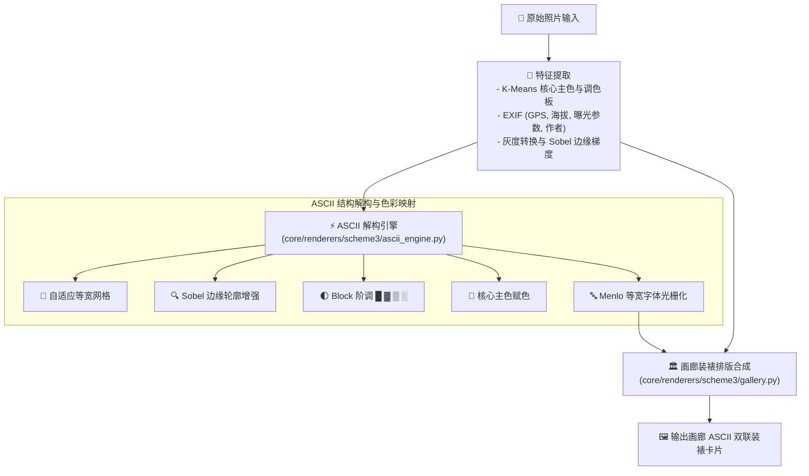

# 🖼️ Scheme 3 黑客终端与 ASCII 结构解构 (Hacker Terminal & ASCII Art Diptych) 技术规范

本文档详细记录 **Scheme 3（黑客终端与 ASCII 结构解构方案）** 的极客终端装裱设计哲学、1:1 正方形画幅自适应、模块化 HUD 控制台结构、智能亮暗自适应调色机制与布局规范。

---

## 1. 核心设计哲学与定位

Scheme 3 专为**极客摄影师与科技美学爱好者**设计：
- **核心定位**：将摄影原作与计算机终端字符艺术深度融合，输出统一的 1:1 正方形画幅；
- **视觉特征**：
  - **原图绝对主导**：100% 忠实保留原片长宽比与原始高精像素细节；
  - **1:1 正方形画幅**：不论横图还是竖图，均动态计算画布并输出统一 1:1 正方形画幅；
  - **抽象卡等比一致**：ASCII 结构画视口比例 100% 严格等同于原图比例，无拉伸变形；
  - **极客 HUD 仪表舱 (Modular Terminal HUD)**：包含状态栏、微反差舱底、1px 终端边框与键值网格；
  - **竖图沉底防溢出排版**：竖图右侧 HUD 遥测网格完全固定在底部，长字段结构化拆行，配合 Auto-Fit 字阶算法彻底防止溢出。

---

## 2. 布局体系 (Layouts)

Scheme 3 精简为两大核心装裱布局（维护在 `config/schemes/scheme3/config.yaml`）：

### 2.1 `gallery_ascii_terminal` (智能自适应黑客终端 HUD 装裱 · 默认)
- **底色模式**：`background_color: "auto"`（智能明暗自适应判定）；
  - **亮色照片**：主色亮色卡纸 + 深墨绿终端字色（`#0A3D1B` / `#28683B`）+ 深墨绿字符解构（消除白块补丁）；
  - **暗色照片**：主色暗黑底板（`#0A0D0A`）+ 黑客荧光绿字色（`#00FF66` / `#39FF14`）+ 荧光绿渐变解构；
- **排版系统**：全量英文机械等宽字体（Menlo / SF Mono），模块化 HUD 控制台容器；
- **画幅结构**：1:1 正方形画布，横图上下 HUD，竖图左右 HUD 且遥测数据完全沉底。

### 2.2 `gallery_ascii_diptych` (原片主色 ASCII 解构双联)
- **底色模式**：`background_color: "auto"`（自动从原片像素提取柔和主色背景）；
- **着色模式**：`color_mode: "local_chromatic"`（保留原图真实色彩的 Block 字符矩阵解构）；
- **排版系统**：原图提取主色调等宽字体排版，配合 4 色核心色卡网格。


#### 设计理念

将原片视觉基因与**主色系 ASCII 字符艺术**深度融合：
- **底板背景**：`background_color: "auto"`（自动从原片像素提取柔和主色背景，形成温润相衬的画廊卡纸）；
- **文字排版**：与主色背景和谐的深色字阶（`#2C2C2C` / `#7A7A7A`）；
- **ASCII 视觉解构**：`color_mode: "local_chromatic"`，使用原片真实主色对 Block 字符矩阵进行精美赋色，配以柔和悬浮微阴影（`shadow.enable: true`）。

#### 布局结构（1:1 正方形自适应画幅与极客 HUD 仪表舱）

**1. 横图结构 (Landscape Orientation) — 1:1 正方形上下 HUD 结构**：
```
+──────────────────────────────────────────────────────────+
│                                                          │
│  +────────────────────────────────────────────────────+  │
│  │                                                    │  │
│  │             摄影原作主画幅 (100% 原始比例)         │  │
│  │           [占据 1:1 正方形画幅上半部核心区域]      │  │
│  │                                                    │  │
│  +────────────────────────────────────────────────────+  │
│                                                          │
│  ┌── [01 / ASCII MATRIX DECODE] ────── [STATUS: OK] ─┐   │
│  │                                                   │   │
│  │       ██████████████░░░░░░░░░░░░███████████       │   │
│  │       (ASCII 抽象卡比例 100% 严格等于原图比例)    │   │
│  │                                                   │   │
│  ├── [02 / TELEMETRY DATA] ──────────────────────────┤   │
│  │  GEAR  :: Nikon Z6III · NIKKOR Z 24-120mm f/4 S   │   │
│  │  EXIF  :: 120mm · f/5.6 · 1/250s · ISO 400        │   │
│  │  GEO   :: 43°40'N 84°07'E · 2503m                 │   │
│  │  AUTH  :: © 2026 Vincent Chyu       TONE :: [■■■■]│   │
│  └───────────────────────────────────────────────────┘   │
│                                                          │
+──────────────────────────────────────────────────────────+
                     (严格 1:1 正方形)
```

**2. 竖图结构 (Portrait Orientation) — 1:1 正方形左右 HUD 结构**：
```
+──────────────────────────────────────────────────────────+
│                                                          │
│  +─────────────────────+  ┌── [01 / MATRIX] ─ [OK] ───┐  │
│  │                     │  │                           │  │
│  │                     │  │    ████████████░░░░███    │  │
│  │                     │  │    (抽象卡比例等于原图)   │  │
│  │                     │  │                           │  │
│  │   摄影原作主画幅    │  ├── [02 / TELEMETRY] ───────┤  │
│  │  (100% 原始竖图)    │  │ CAMERA :: Nikon Z6III     │  │
│  │ [占据左侧主导核心]  │  │ OPTICS :: 24-120mm f/4 S  │  │
│  │                     │  │ EXIF   :: 120mm f/5.6     │  │
│  │                     │  │ GEO    :: 43°40'N 84°07'E │  │
│  │                     │  │ AUTH   :: © Vincent Chyu  │  │
│  │                     │  │ TONE   :: [■][■][■][■]    │  │
│  +─────────────────────+  └───────────────────────────┘  │
│                                                          │
+──────────────────────────────────────────────────────────+
                     (严格 1:1 正方形)
```

### 3.5 `gallery_ascii_terminal` (自适应机械终端黑客装裱)

#### 设计哲学与自适应调色机制

打破传统单一纯黑底板在亮色照片下的割裂感，实现智能主色明暗自适应终端调色与全量英文机械等宽排版：
- **字体系统**：全量文字使用系统英文等宽/机械终端字体（`Menlo` / `SF Mono` / `Monaco` / `Courier`），呈现极具极客质感的终端命令行美学；
- **自适应调色逻辑**：
  1. **当照片主色为【明亮】时**：
     - **背景卡**：自动使用从原片像素提取的**主色亮色**（温润高明度卡纸）；
     - **终端字色**：符合终端的**黑客深墨绿**（`#0A3D1B` / `#28683B`）；
     - **ASCII 解构**：`dark_matrix_green`（深墨绿阶调），`invert: false`（亮处天空等留白透底，暗处树木呈现深墨绿字符，彻底消除实心色块补丁）；
     - **悬浮阴影**：开启柔和漫反射阴影。
  2. **当照片主色为【暗色】时**：
     - **背景卡**：自动使用从原片像素提取的**主色暗色**（深邃暗黑曜石绿/暗黑底板 `#0A0D0A`）；
     - **终端字色**：符合终端的**高亮黑客荧光绿**（`#00FF66` / `#009944`）；
     - **ASCII 解构**：`matrix_green`（黑客荧光绿阶调），`invert: true`（暗处透出黑底，亮处显发光字符）；
     - **悬浮阴影**：纯平暗夜无阴影。

#### 架构流程



#### ASCII 引擎配置参数

| 参数 | 默认值 | 说明 |
|------|--------|------|
| `columns` | `100` | 字符网格列数（越大越精细） |
| `char_set` | `"block"` | 字符集：`"block"` (█▓▒░) 或 `"ascii"` (.·:-=+*#%@) |
| `edge_enhance` | `true` | Sobel 边缘增强开关 |
| `edge_threshold` | `30` | 边缘阈值 (0-255) |
| `color_mode` | `"local_chromatic"` | 着色模式 |
| `font_size` | `14` | 等宽字体渲染点数 |
| `panel_height_ratio` | `0.35` | ASCII 面板占照片高度的最大比例 |
| `n_palette_colors` | `4` | 提取的调色板核心色数量 |

#### 颜色模式

| 模式 | 说明 |
|------|------|
| `dominant_mono` | 全部字符使用照片核心主色（单色版画风） |
| `local_chromatic` | 每个字符保留原图对应位置的真实颜色（默认推荐） |
| `palette_gradient` | 基于亮度在调色板颜色之间插值映射 |

#### 元数据排版规范

- **横构图 1:1 HUD 布局**：
  - **`[01 / ASCII MATRIX DECODE]`**：顶部状态栏，包含 ASCII 矩阵视口（比例与原图 100% 严格一致）
  - **`[02 / TELEMETRY DATA]`**：底部结构化遥测网格（`GEAR ::`、`EXIF ::`、`GEO ::`、`AUTH ::`、`TONE ::` 色卡）
- **竖构图 1:1 HUD 布局**：
  - **`[01 / MATRIX DECODE]`**：顶部状态栏，ASCII 矩阵在上半视口居中
  - **`[02 / TELEMETRY]`**：底部牢固沉底的遥测网格，长参数自动结构化拆行（`MODEL`、`LENS`、`FOCAL`、`SHUTTER`、`GEO`、`AUTH`、`TONE`），配合 Auto-Fit 字阶算法彻底防止溢出。
- **作者名规范**：统一调用公共包 `fmt_artist(exif, default_artist)` 提取纯净作者名（如 `Vincent Chyu`），不再冗余拼接 `© 年份`。

---

## 4. 产物与 CLI 调用指南

```bash
# 1. 默认智能自适应黑客终端 HUD 装裱 (gallery_ascii_terminal · 推荐)
python3 generate_photo_cards.py --source test --scheme scheme3 --layout gallery_ascii_terminal --compression jpeg

# 2. 原片主色真实色彩 ASCII 结构解构双联 (gallery_ascii_diptych)
python3 generate_photo_cards.py --source test --scheme scheme3 --layout gallery_ascii_diptych --compression jpeg
```

---

## 5. 模块结构

```
core/renderers/scheme3/
├── __init__.py          # 导出 Scheme3Renderer
├── renderer.py          # 渲染器入口，委托 gallery.py
├── gallery.py           # 终端与 ASCII 结构画渲染（含 1:1 正方形横竖图 HUD 布局、沉底排版、字阶防溢出）
└── ascii_engine.py      # ASCII 结构解构引擎（Block/ASCII 字符集、Sobel 边缘、黑客绿/暗墨绿着色、自适应明暗判定）
```

