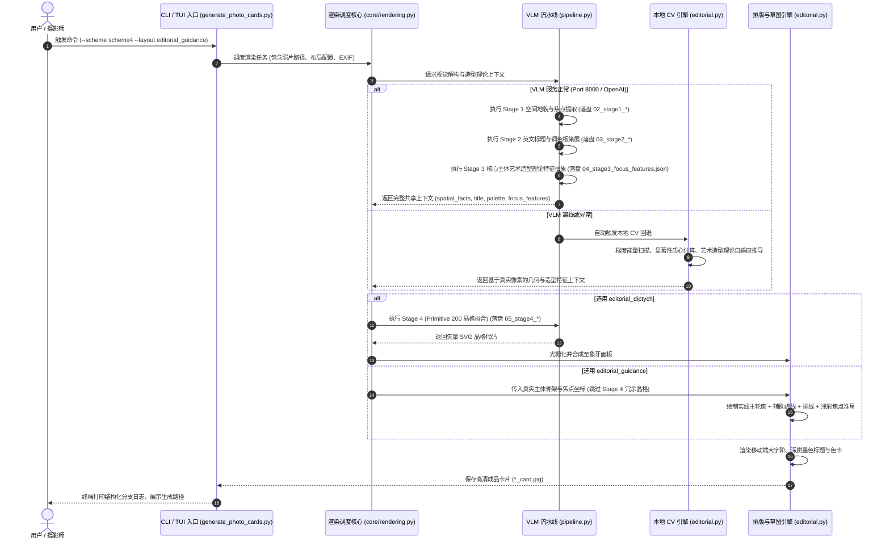

# 🏛️ Scheme 4 编辑艺术双联 (Editorial Art Diptych) 技术方案与交互流程规范

本文档详细记录 **Scheme 4（编辑艺术双联方案）** 的系统架构、多模态大模型与本地计算机视觉流水线、共享上下文规范、子方案分流机制以及完整的端到端交互流程。

---

## 1. 核心设计哲学与架构定位

Scheme 4 旨在将古典画廊级策展品味与现代生成式 AI 视觉解构相结合：
- **上方画幅**：保留摄影作品真实浓郁的光影质感与情感张力；
- **下方画廊面板（#F3F0E8 象牙白）**：通过“微观肌理”或“精工手稿引导”对上方照片进行艺术维度的二次解构与呼应；
- **双子方案并行体系**：
  1. **`editorial_diptych`**：经典几何多边形/Triangle Delaunay 晶格拟合，呈现原片微观色彩肌理；
  2. **`editorial_guidance`**：画廊精工手稿风，用实线主轮廓、辅助虚线、光影排线与浅彩焦点微标，引导用户洞悉画面的视觉骨架与核心焦点主体。

### 1.1 编辑双联排版布局结构 (Editorial Diptych Architecture)

```
+------------------------------------------------------------------------+
|                                                                        |
|                          摄影原作主画幅 (100% 原始比例)                 |
|                                                                        |
+------------------------------------------------------------------------+
|                                                                        |
|                +--------------------------------------+                |
|                |                                      |                |
|                |    Stage 4 几何肌理 / 精工细线手稿    |                |
|                |                                      |                |
|                +--------------------------------------+                |
|                                                                        |
|                       策展大标题 (POETIC TITLE)                        |
|                     诗性副标 (evocative subtitle)                      |
|                                                                        |
|   35°41'N 139°46'E · 42m · 24mm f/4 1/125s ISO 100    [■ ■ ■ ■ 色卡]   |
+------------------------------------------------------------------------+
```

---

## 2. 系统端到端架构流程图 (Architecture Flowchart)

```mermaid
flowchart TD
    PhotoInput["📸 输入照片 (EXIF / GPS / 像素)"] --> Preprocess["🔬 预处理与元数据提取
- EXIF 解析 (GPS, 海拔, 拍摄参数)
- 1024px 缩略图下采样 (RGB / 灰度)"]
    
    Preprocess --> VLM_Check{"🌐 VLM 服务是否可用?
(MLX / Localhost 8000 / OpenAI)"}
    
    %% VLM 分支
    VLM_Check -->|"正常可用"| VLM_P["🚀 VLM 四阶段递进式视觉感知与抽象流水线"]
    subgraph VLM_Pipeline ["VLM 感知与抽象流水线 (core/renderers/scheme4/pipeline.py)"]
        VLM_P --> Stage1["🔍 Stage 1: 空间地貌与主体解构
- 场景分类 (scene_type)
- 核心主体重心与坐标 (center / bbox)
- 空间地平高度 (horizon_y)
- 关键点与地貌骨架 (keypoints)"]
        Stage1 --> Stage2["✍️ Stage 2: 画廊标题与调色板策展
- 英文大标题 (title)
- 诗性英文副标题 (subtitle)
- 典雅调色板 (palette: dominant/dark/neutral/accent)"]
        Stage2 --> Stage3["🎨 Stage 3: 核心主焦点艺术造型理论特征抽象
- 康定斯基点线面动力学 (kandinsky_elemental_grammar)
- 保罗·克利生长力学 (klee_genesis_and_growth)
- 塞尚几何体块微切面 (cezanne_volumetric_faceting)
- 格式塔知觉场与图底关系 (gestalt_field_dynamics)
- 微观精工排线与表面节理 (micro_hatching_and_strata)
- 矿物点睛灵魂 (chromatic_soul)
- 策展抽象隐喻与精简法则 (curatorial_abstract_metaphor)"]
    end
    
    %% 本地 CV 分支
    VLM_Check -->|"异常或离线"| LocalCV["⚡ 本地计算机视觉算法 (Local CV Engine)
- Sobel / Gaussian 梯度脊线分析
- 显著性边缘质心加权检测
- 真实主轮廓点集扫描 (primary_pts)
- 真实副轮廓点集扫描 (secondary_pts)
- 自适应艺术造型理论特征规则推导"]

    %% 汇聚到共享上下文
    Stage3 --> SharedContext["🌟 统一共享上下文 (Unified Shared Context)
包含: spatial_facts, title, subtitle, palette, focus_features, scene_type"]
    LocalCV --> SharedContext

    %% 布局分流
    SharedContext --> LayoutBranch{"📐 布局渲染分支 (Layout Style)"}
    
    %% 方案一分支
    LayoutBranch -->|"editorial_diptych
(style: primitive_mesh)"| PrimitiveStage["🧩 Stage 4: Primitive 晶格拟合引擎
- 200 个几何多边形退火优化
- SVG 矢量生成与超采样光栅化
- 呈现微观油画质感与色彩肌理"]
    
    %% 方案二分支
    LayoutBranch -->|"editorial_guidance
(style: architectural_line)"| GuidanceStage["🏛️ 精工细线手稿解构引擎
- 实体平滑主轮廓曲线 (Hero Solid Spline)
- 空间基准地平轴线 (Composition Axis)
- 优雅空间辅助虚线 (Dashed Spline)
- 极轻半透动态光影排线 (5条平行钢笔排线)
- 浅彩底 + 十字准星微标 (Soft Pastel Tint)"]

    %% 统一画板装裱与排版
    PrimitiveStage --> Assembler["🖼️ 画板装裱与移动端高阶排版 (Layout Assembler)
- 象牙色面板装裱框 (#F3F0E8)
- 移动端大字阶古典衬线排版 (80% 深炭墨色)
- 四色画廊调色板色卡 (Palette Swatches)
- 经纬度/海拔/拍摄参数元数据行"]
    GuidanceStage --> Assembler

    Assembler --> Output["📦 输出最终画廊卡片 (JPEG / WebP / PNG)
- 输出卡片: *_card.jpg
- Debug 过程完整产物: *_debug/ (01~08 节点落盘)"]
```



---

## 3. 交互时序流程图 (Interaction Sequence Diagram)



---

## 4. 共享上下文与造型特征数据模型 (Shared Context & Art Theory Schema)

`editorial_diptych` 与 `editorial_guidance` 共享以下完整数据上下文，并在 Debug 模式下完整落盘 `04_stage3_focus_features.json`：

```json
{
  "title": "REACHING ACROSS THE LAKE",
  "subtitle": "a playful connection under alpine light",
  "scene_type": "portrait",
  "palette": {
    "dominant": [171, 197, 227],
    "dark": [80, 84, 88],
    "neutral": [161, 197, 237],
    "accent": [161, 197, 237]
  },
  "spatial_facts": {
    "composition_axis": {
      "horizon_y": 0.45,
      "slope_angle_deg": -5.2
    },
    "saliency_foci": [
      {
        "label": "REACHING HAND",
        "subject_type": "gesture",
        "center": [0.510, 0.587],
        "bbox": [0.35, 0.20, 0.65, 0.85]
      }
    ]
  },
  "focus_features": {
    "hero_label": "REACHING HAND",
    "subject_type": "gesture",
    "kandinsky_elemental_grammar": {
      "primary_point_nature": "kinetic_pivot",
      "primary_line_trajectory": "curvilinear_undulation",
      "tension_level": 0.82,
      "force_vectors": [{"name": "forward_reach", "start": [0.35, 0.70], "end": [0.51, 0.58], "angle_deg": -25.0}],
      "basic_plane_gravity": "liminal_boundary"
    },
    "klee_genesis_and_growth": {
      "genesis_action": "reaching_across_space",
      "dendritic_morphology": {"branching_order": 1, "divergence_angle_deg": 38.0, "taper_factor": 0.45},
      "gravitational_equilibrium": "anti_gravity_thrust"
    },
    "cezanne_volumetric_faceting": {
      "geometric_archetype": "planar_polyhedron",
      "facet_planes": [
        {"name": "dorsal_highlight", "orientation": "top", "tone_level": "highlight"},
        {"name": "palmar_shadow", "orientation": "bottom", "tone_level": "deep_shadow"}
      ],
      "terminator_line_style": "soft_diffused_edge"
    },
    "gestalt_field_dynamics": {
      "figure_ground_relation": "high_relief_silhouette",
      "closure_tendency": "open_dispersive",
      "perceptual_weight_offset": [0.05, -0.08]
    },
    "micro_hatching_and_strata": {
      "hatching_logic": "parallel_shadow_stream",
      "hatching_density": "sparse_breathing_5lines",
      "hatching_angle_deg": -40.0,
      "surface_strata": "organic_flesh_contour"
    },
    "chromatic_soul": {
      "chromatic_temperature": "warm_earth_ochre",
      "hero_dominant_color": "#A88365",
      "focal_accent_pop": "#D47A5A",
      "tint_alpha": 0.85
    },
    "curatorial_abstract_metaphor": {
      "formal_concept_title": "KINETIC TENSION IN DIALOGUE",
      "curatorial_reduction_rule": "Preserve gestural vector, anchor with soft tint crosshair"
    }
  }
}
```

---

## 8. 5 阶段流水线、解耦抽色美学工序与 Debug 产物规范 (2026-08 升级)

### 8.1 全流程 5 阶段递进与耗时统计 (5 Stages Pipeline)

流水线严格拆解为 5 大单调递增逻辑阶段，并在终端中输出 `[20%]`, `[40%]`, `[60%]`, `[80%]`, `[100%]` 进度与最终耗时卡片：

| 阶段编号 | 进度 | 阶段职责与核心动作 |
| :--- | :---: | :--- |
| **Stage 1** | 20% | **VLM 空间地貌与主体解构**：提取 scene_type、saliency_foci、center/bbox、composition_axis |
| **Stage 2** | 40% | **VLM 文学立意策展**：生成画廊级英文标题 (title) 与诗性副标 (subtitle) |
| **Stage 3** | 60% | **VLM 艺术造型理论特征抽象**：解析康定斯基、克利、塞尚、格式塔造型特征 (03_stage3_focus_features.json) |
| **Stage 4** | 80% | **CPU 高精几何剖分与解耦式抽色工序**：Triangle Delaunay 高精三角面片剖分与 4 项美学子工序 |
| **Stage 5** | 100% | **画布光栅化与双联排版合成**：透明图层光栅化、大字阶排版与最终双联卡片成品合成 |

### 8.2 阶段 4 解耦式抽色美学子工序体系 (Selective Chromatic Pop)

在 Stage 4 中，针对画廊当代艺术美学需求，抽色与视觉聚焦被拆解为 4 个完全解耦的独立纯函数工序，每个工序均支持独立开关与独立产物落盘：

- **工序 4.1 (`step1_selective_pop`)**：基础主体矿物色彩保留 + 背景区域柔和去饱和至淡灰；
- **工序 4.2 (`step2_tension_bridge`)**：多主体视线引力场张力连结（在多主体连线上保留 30% 饱和度）；
- **工序 4.3 (`step3_chromatic_tint`)**：胶片暗房冷矿青/暖砂岩底色注入（为背景注入 18% 环境色相）；
- **工序 4.4 (`step4_alpha_dissolve`)**：象牙白底板 Alpha 渐隐消融（背景边缘多边形透明度向外衰减至 35%）。

### 8.3 严格单调递增的 Debug 过程态产物命名

在 Debug 模式（`--debug`）下，Debug 目录中的所有中间文件严格按照阶段编号 `00_` ~ `05_` 命名，文件管理器正序排列与时间线绝对吻合：

```text
<photo_stem>_debug/
├── 00_input_thumbnail.jpg                   # [前置输入] VLM 分析缩略图 (1024px)
├── 01_stage1_parsed.json                     # [阶段 1] 空间地貌与主体解构事实
├── 01_stage1_prompt_system.txt              # [阶段 1] 系统提示词
├── 01_stage1_prompt_user.txt                # [阶段 1] 用户提示词 (含 GPS/海拔物理事实)
├── 01_stage1_raw_response.txt               # [阶段 1] VLM 思考与原始响应
│
├── 02_stage2_parsed.json                     # [阶段 2] 文学策展与英文标题
├── 02_stage2_prompt_system.txt              # [阶段 2] 系统提示词
├── 02_stage2_prompt_user.txt                # [阶段 2] 用户提示词
├── 02_stage2_raw_response.txt               # [阶段 2] VLM 思考与原始响应
│
├── 03_stage3_focus_features.json            # [阶段 3] 造型理论抽象特征 JSON
├── 03_stage3_prompt_system.txt              # [阶段 3] 系统提示词
├── 03_stage3_prompt_user.txt                # [阶段 3] 用户提示词
├── 03_stage3_raw_response.txt               # [阶段 3] VLM 思考与原始响应
│
├── 04_00_stage4_artwork_raw.svg             # [阶段 4-0] Triangle 原生全彩三角面片矢量图
├── 04_01_stage4_selective_pop.svg           # [阶段 4-1] 子工序: 主体留色 + 背景去饱和
├── 04_02_stage4_tension_bridge.svg          # [阶段 4-2] 子工序: 多主体视线引力场张力 (多主体开启时生成)
├── 04_03_stage4_chromatic_tint.svg          # [阶段 4-3] 子工序: 胶片暗房底色微调 (开启时生成)
├── 04_04_stage4_alpha_dissolve.svg          # [阶段 4-4] 子工序: 象牙底板 Alpha 渐隐消融 (开启时生成)
├── 04_stage4_artwork_final.svg              # [阶段 4 汇聚] 阶段 4 最终生效矢量代码
├── 04_stage4_pipeline_stats.json            # [阶段 4 统计] 几何晶格与抽色工序统计
│
├── 05_01_svg_rasterized_layer.png           # [阶段 5-1] 高精光栅化出的透明 PNG 母题图层
└── 05_02_final_card.jpg                     # [阶段 5-2] 最终排版生成的画廊双联成品大卡
```

