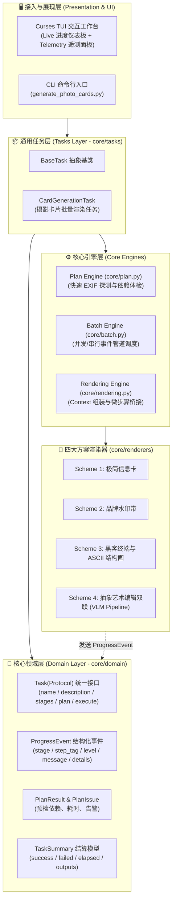
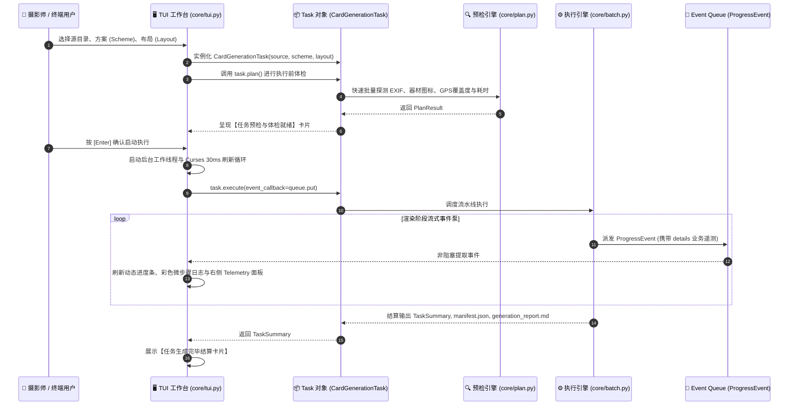

# ⚙️ PicFrame 任务架构、流式进度与遥测洞察系统规范 (Task & Progress Architecture)

本文档详细阐述 PicFrame 的任务领域模型、两阶段执行生命周期（Dry-Run / Plan ➔ Execute）、流式事件泵机制、通用微步骤日志规范以及 TUI 实时双栏遥测面板的设计与工程实现。

---

## 一、 系统架构分层与设计哲学 (Clean Architecture)

系统遵循整洁架构原则，将业务领域抽象、任务流水线调度、多方案渲染内核与外围交互界面（CLI / Curses TUI）严格解耦：



---

## 二、 任务生命周期与两阶段执行模型 (Two-Stage Execution)



---

## 三、 三层日志与微步骤汇报规范 (Three-Tier Reporting Protocol)

为了消除“黑盒”等待并提供极致的工程透明度，系统建立了标准的三层汇报规范：

```
Level 1: 批处理流水线层 (Batch Pipeline)
  ├── 1. 扫描与依赖体检 (Stage: SCANNING / PRECHECK)
  ├── 2. 批量 EXIF 读取 (Stage: EXIF_BATCH)
  ├── 3. 多并发/串行渲染 (Stage: RENDERING)
  ├── 4. 格式压缩与联系单生成 (Stage: CONTACT_SHEET)
  ├── 5. 任务清单与报告落盘 (Stage: MANIFEST)
  └── 6. 任务完成与结算 (Stage: COMPLETE)

Level 2: 单图微步骤生命周期 (Per-Photo Step Lifecycle)
  ├── [EXIF]    : 元数据提取、格式化与物理事实校验 (机身/镜头/曝光/GPS/海拔)
  ├── [Asset]   : 机身/镜头 PNG 匹配、品牌 Logo 匹配 (如 Z6III.png、Apple/Sony 图标)
  ├── [Palette] : 主题基底与软调色板提取 (HLS 采样、背景色计算)
  ├── [Core]    : 各方案核心算法节点 (ASCII 字符矩阵量化 / 水印带高度计算 / VLM 几何剖分)
  └── [Render]  : 阴影/双胶囊/画框装裱合成

Level 3: 容错与客制化遥测层 (Issue & Telemetry Payload)
  ├── PlanIssue : 记录非致命降级或错误（原因 Reason + 优化建议 Suggestion）
  └── details   : 字典载荷，携带方案特有的业务数据供 UI / 报表消费
```

---

## 四、 四大方案专属业务数据矩阵 (Telemetry Payloads)

通过 `ProgressEvent.details` 传递方案专属的结构化语义数据，驱动 TUI 界面实时展示：

| 方案 | 微步骤标签 | 核心客制化业务字段 (Telemetry Payload) | 说明 |
| :--- | :--- | :--- | :--- |
| **Scheme 4**<br/>(抽象艺术编辑双联) | `[VLM 1/5]`<br/>`[VLM 2/5]`<br/>`[VLM 3/5]`<br/>`[VLM 4/5]` | • `scene_type`: 场景类型 (如 `landscape / alpine`)<br/>• `mood`: 光影与时令氛围 (如 `冷调晨曦 / 暮光薄雾`)<br/>• `hero_focus`: 核心主角与归一化坐标 (如 `主峰 @ (0.54, 0.32)`)<br/>• `title` / `subtitle`: 中英双语策展标题与诗性副标<br/>• `concept_title`: 艺术理论流派 (如 `Kandinsky & Klee Abstraction`)<br/>• `palette_hex`: 4 色 Hex 调色板 (`dominant`, `dark`, `neutral`, `accent`)<br/>• `geometry_mode` / `svg_len`: 几何面片剖分模式与生成 SVG 字符数 | 全程实时解构 VLM 语义与造型工序 |
| **Scheme 3**<br/>(黑客终端/ASCII) | `[EXIF]`<br/>`[Sobel]`<br/>`[ASCII]`<br/>`[Render]` | • `camera`: 提取机身型号<br/>• `gps`: 真实经纬度与海拔遥测 (`23°09'N 113°16'E · 1018m`)<br/>• `edge_kernel`: Sobel 3x3 边缘梯度算子状态<br/>• `charset`: 4 阶 Block 字符集 (`█▓▒░`)<br/>• `bg_color`: 自适应明暗 HUD 背景色 RGB | 极客计算机与摄影遥测数据 |
| **Scheme 2**<br/>(品牌极简水印带) | `[EXIF]`<br/>`[Watermark]`<br/>`[Render]` | • `camera` / `lens`: 机身与镜头型号<br/>• `brand_logo`: 匹配到的品牌官方矢量 Logo 状态<br/>• `watermark_layout`: 水印排版模式 (`watermark_right_logo`)<br/>• `mode`: `lossless_bottom_band` (无损底部拼接算法) | 无损原片画幅与水印对齐参数 |
| **Scheme 1**<br/>(极简信息卡) | `[EXIF]`<br/>`[Asset]`<br/>`[Palette]`<br/>`[Render]` | • `camera` / `lens` / `exposure`: 曝光三要素与参数字串<br/>• `camera_asset` / `lens_asset`: 官方高清机身/镜头 PNG 匹配状态<br/>• `bg_rgb`: 基于主色调聚类的柔和底色 RGB<br/>• `layout`: 3:4 竖图或 4:3 横图排版结构 | 器材拟物化剪影与自适应胶囊排版 |

---

## 五、 TUI 实时双栏遥测工作台设计 (Curses Telemetry Inspector)

TUI 界面使用分级色彩与自适应双栏布局：

```
┌─────────────────────────────────────────────────────────────────────────────┐
│ ⚡ PicFrame 摄影卡片批量渲染流水线                                            │
├─────────────────────────────────────────────────────────────────────────────┤
│ 阶段: 生成摄影卡片 (4/12)   [████████████░░░░░░░░░░░░░░░░░░] 33% (绿色高亮)  │
│ 正在处理: DSC_0004.JPG  |  方案: scheme4 (editorial_diptych)               │
├──────────────────────────────────────┬──────────────────────────────────────┤
│ 📜 实时微步骤事件日志 (左栏 52%)      │ 🛰️ 方案客制化业务数据与遥测 (右栏 46%)│
│                                      │                                      │
│ • [EXIF] 📷 提取参数与物理事实 (绿)  │ 方案4 视觉解构与语义事实:            │
│ • [VLM 1/5] 🔍 场景与主角解构 (青)   │ ├─ 场景地貌: 高原雪山 / 冷调晨曦      │
│ • [VLM 2/5] ✍️ 策展级双语标题 (青)   │ ├─ 核心主角: 冰川主峰 @ (0.54, 0.32) │
│ • [VLM 3/5] 🎨 造型理论与配色 (洋红) │ ├─ 策展标题: "Eternal Solitude"      │
│ • [VLM 4/5] 🧩 几何剖分/SVG合成 (洋红)│ ├─ 艺术理论: 康定斯基点线面造型理论   │
│ • [Editorial] 🖼️ 象牙白画廊装裱 (绿) │ ├─ 提取色板: #1C2E3D #A3B899 #E8E0D2 │
│                                      │ └─ 几何工序: 200 点 Delaunay 剖分     │
└──────────────────────────────────────┴──────────────────────────────────────┘
```

### 色彩分级标准：
- **🟢 绿色 (`COLOR_GREEN` | `A_BOLD`)**：关键步骤成功完成、官方高清器材图标命中、策展主标题；
- **🌐 青色 (`COLOR_CYAN`)**：AI / VLM 视觉感知、场景地貌、空间主角坐标、曝光参数；
- **🟣 洋红 (`COLOR_MAGENTA`)**：几何图元剖分、SVG 矢量生成、ASCII 字符矩阵、艺术理论；
- **🟡 黄色 (`COLOR_YELLOW` | `A_STANDOUT`)**：非致命性告警（如缺少特定镜头图标时使用默认图标兜底）；
- **🔴 红色 (`COLOR_RED` | `A_STANDOUT`)**：严重错误与异常。

---

## 六、 任务接口规范与扩展指南 (Developer Guide)

### 1. `Task` 接口协议定义 ([core/domain/task.py](file:///Users/vincent/Developer/code/python_code/PicFrame/core/domain/task.py))

```python
from typing import Callable, Protocol, runtime_checkable
from .events import PipelineStage, ProgressEvent

@runtime_checkable
class Task(Protocol):
    @property
    def name(self) -> str:
        """任务中文显示名称"""
        ...

    @property
    def description(self) -> str:
        """任务详细描述"""
        ...

    def stages(self) -> list[PipelineStage]:
        """返回该任务专有的流水线阶段列表"""
        ...

    def plan(self) -> PlanResult:
        """执行预检（Dry-Run），评估依赖、耗时与潜在告警，不产生实际写入"""
        ...

    def execute(self, event_callback: Callable[[ProgressEvent], None] | None = None) -> TaskSummary:
        """执行真实流水线，实时通过 event_callback 发送结构化进度事件并返回最终结算指标"""
        ...
```

### 2. 扩展新任务示例 (如 `ExifExportTask`)

只需要在 `core/tasks/` 下继承 `BaseTask` 并实现相应接口：

```python
from core.tasks.base import BaseTask
from core.domain.events import PipelineStage, ProgressEvent
from core.domain.task import PlanResult, TaskSummary

class ExifExportTask(BaseTask):
    """批量提取照片 EXIF 并导出 CSV/JSON 报表任务"""
    
    @property
    def name(self) -> str:
        return "EXIF 元数据批量导出"

    @property
    def description(self) -> str:
        return "扫描照片并导出包含拍摄时间、GPS、镜头机身的结构化报表"

    def stages(self) -> list[PipelineStage]:
        return [PipelineStage.SCANNING, PipelineStage.EXIF_BATCH, PipelineStage.COMPLETE]

    def plan(self) -> PlanResult:
        # 实现快速预检
        ...

    def execute(self, event_callback=None) -> TaskSummary:
        # 执行导出并流式上报 ProgressEvent
        ...
```
